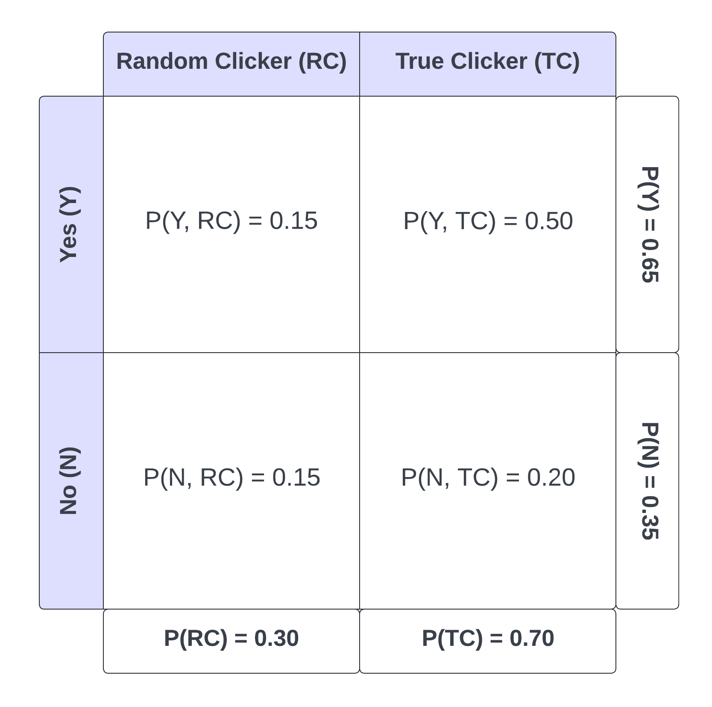

```{r}
library(dplyr)
library(ggplot2)
library(forcats)
library(reshape2)
library(knitr)
```


# Probability Practice

### Part a.

P(Y) = 0.65
P(N) = 0.35
P(RC) = 0.3
P(TC) = 0.7 (P(RC)-1)
P(Y|RC) = 0.5
P(N|RC) = 0.5

These probabilities are summarized in the table below:



We're looking for P(Y|TC) so we can use the rule of total probability:

P(Y) = P(Y, TC) + P(Y, RC) = P(TC) * P(Y|TC) + P(RC) * P(Y|RC)

We know all of these inputs to the equation except for P(Y|TC), so we want to solve for that unknown.

0.65 = 0.7 * P(Y|TC) + 0.3 * 0.5

From the above equation, we find that P(Y|TC) $\approx$ 0.714286. This means that truthful clickers answer yes to the question about 71.43% of the time.

### Part b.

P(Disease) = 0.000025
P(No Disease) = 0.999975 (1-0.000025)
P(Positive|Disease) = .993
P(Negative|No Disease) = 0.9999

The probabilities above are summarized in the tree diagram below:


We're looking for P(Disease|Positive) so we can use Baye's Law:

$\frac{P(Disease)*P(Positive|Disease)}{P(Disease)*P(Positive|Disease)+P(No Disease)*P(Positive|No Disease)}$

We have almost all of the inputs that we need, however, we're missing P(Positive|No Disease). These are false positives. We can find the missing probability by taking 1 - true negatives, or 1 - 0.9999 to get P(Positive|No Disease) as 0.0001. Now we can solve for P(Disease|Positive).

$\frac{0.000025*0.993}{0.000025*0.993+0.999975*0.0001}$ $\approx$ .198882. Thus, if someone tests positive, they have about a 19.89% chance of actually having the disease.

# Wrangling the Billboard Top 100

```{r}
billboard = read.csv("data/billboard.csv")
```

#Need a caption - probably something about how most are recent songs

### Part a.

```{r,include=FALSE}
billboard %>%
  group_by(performer,song) %>%
  summarize(count = n()) %>%
  arrange(desc(count)) %>%
  head(10)
```

The table above shows the top 10 longest lasting songs on the Billboard 100. It reveals that a majority of these long-lasting songs are more recent songs.

### Part b.

```{r}
musical_diversity = billboard %>%
  filter(year != 1958 & year != 2021) %>%
  group_by(year) %>%
  summarize(song_performer = paste(performer, song),unique_songs_per_year=length(unique(song_performer)))

ggplot(musical_diversity) + geom_line(aes(x = year, y = unique_songs_per_year)) + xlab("Year") + ylab("Number of Unique Songs") + ggtitle("Number of Unique Songs per Year")
```

As seen in the plot, the number of unique songs steadily decreased from roughly 1965 to a overall minimum of just below 400 songs around 2000. Since then, the trend has been increasing and in the last year of data (2020), there were about 800 unique songs. It looks like it's on trend to surpass its historical max in the mid 1960s (about 830).

### Part c.

```{r}
ten_week_hit_songs <- billboard %>%
  group_by(performer,song) %>%
  summarize(ten_week_hit = ifelse(n()>=10,"Yes","No")) %>%
  filter(ten_week_hit == "Yes")

top_artists <- ten_week_hit_songs %>%
  group_by(performer) %>%
  summarize(num_ten_week_hit = n()) %>%
  filter(num_ten_week_hit>=30)

ggplot(top_artists) + geom_bar(aes(x = fct_reorder(performer,num_ten_week_hit), y = num_ten_week_hit),stat = "identity",fill="cornflowerblue") + coord_flip() + xlab("Artist Name") + ylab("Number of Ten Week Hits") + ggtitle("Artists With at Least 30 Ten Week Hits")
```

Given the bar plot above, it shows us that Elton John had the most 10 week hits with just over 50. The other 18 artists in the plot seem to be a mix of generations and genres, but they all are relatively well known which makes sense given that they have so many hits.

#Visual story telling part 1: green buildings

```{r,include=FALSE}
green_buildings = read.csv("data/greenbuildings.csv")
green_buildings$green_rating <- ifelse(green_buildings$green_rating==0,"Non-Green","Green")
```

```{r,include=FALSE}
#Look at correlations with green_rating, to get an initial idea of what variables to look at
cor(green_buildings['green_rating'],green_buildings[! colnames(green_buildings) %in% c('green_rating')])
```

To begin this problem, we can look at the distribution of rents for green buildings vs. non-green buildings and we see that indeed green buildings have a slightly higher median rent than non-green buildings. We're already skeptical of the stats guru, because while yes, there is a difference in rents, it's really not very significant.

*Figure 1*
```{r,echo=FALSE}
ggplot(green_buildings, aes(x = green_rating, y = Rent ,group = green_rating)) + geom_boxplot() + xlab("Green Rating") + ggtitle("Rent vs. Green Rating")
```

Even though the rent premium wasn't that large, if the leasing rate in green buildings was substantially higher, the larger volume of tenants to charge rent to might still justify undergoing the investment. However, the boxplot below suggests that there's not a huge difference in the median leasing rates between green and non-green buildings.

*Figure 2*
```{r,echo=FALSE}
ggplot(green_buildings, aes(x = green_rating, y = leasing_rate,group = green_rating)) + geom_boxplot() + xlab("Green Rating") + ggtitle("Rent vs. Green Rating") +ylab("Leasing Rate") + ggtitle("Leasing Rate vs. Green Rating")
```

We also wanted to explore some confounding variables that may be influencing the relationship between rent and green rating. The plot below reveals that green buildings tend to be significantly newer compared to non-green buildings. This could be a problem because perhaps the premium of green buildings is just because they're newer buildings.

*Figure 3*
```{r}
ggplot(green_buildings, aes(x = green_rating, y = age, group = green_rating)) + geom_boxplot() + xlab("Green Rating") + ylab("Building Age") + ggtitle("Building Age vs. Green Rating")
```

The plot below "adjusts" for age by plotting the 10 year rolling average rent vs. age and then faceted by green vs. non-green buildings. It shows that the average rents between green vs. non-green buildings doesn't appear to be significantly different in the range of 0-100 years of age. Interestingly, we found that there are some very old (100-150 years) non-green buildings that have very low 10 year rolling average rents whereas there are no green buildings in this age range. It seems as though the very old non-green buildings may be the reason for the median rent discrepancy shown in Figure 1.

*Figure 4*
```{r}
#Get rolling average of rents for each decade 
green_buildings$decade <- (green_buildings$age%/%10)*10
decade_data <- green_buildings %>% 
  group_by(decade) %>% 
  mutate(rec = 1) %>% 
  mutate(rollavg = cumsum(Rent)/cumsum(rec)) %>% 
  select(-rec)
labels = c("Green","Not Green")
ggplot(decade_data, aes(x = age, y = rollavg)) + geom_line() + facet_grid(. ~ green_rating) + xlab("Building Age") + ylab("10 Year Rolling Average Rent")
```

Another confounding variable that we noticed was building class. There are many more buildings of class A (higher quality) than class B for green buildings and the opposite for non-green. Thus, the rent discrepancy in Figure 1 could just be because of quality differences.

*Figure 5*
```{r,echo=FALSE}
green_buildings$class <- ifelse(green_buildings$class_a,"A","B")
ggplot(green_buildings, aes(x = class)) + geom_bar(stat="count") + facet_grid(.~green_rating) + xlab("Class") + ylab("Count") + ggtitle("Frequencies of Green vs. Non-Green Buildings by Class")
```

Figures 6 and 7 below "adjust" for class by having a pair of box plots showing rent vs. green rating for class A buildings and then another set of box plots for class B buildings. After controlling for building class, in both plots the median rent for green and non-green buildings were not significantly different. 

*Figure 6*
```{r}
classa_subset <- subset(green_buildings, green_buildings$class=="A")
classb_subset <- subset(green_buildings,green_buildings$class=="B")
ggplot(classa_subset, aes(x = green_rating, y = Rent ,group = green_rating)) + geom_boxplot() + xlab("Green Rating") + ggtitle("Rent vs. Green Rating - Class A")
```

*Figure 7*
```{r}
ggplot(classb_subset, aes(x = green_rating, y = Rent ,group = green_rating)) + geom_boxplot() + xlab("Green Rating") + ggtitle("Rent vs. Green Rating - Class B")
```

Overall, there doesn't seem to be a significant difference in median rents between green and non-green buildings which was true even after controlling for building age and building class. If we were to get a different sample of green vs. non-green buildings, it's possible that the median rent for green buildings could be lower than non-green buildings because the medians in our sample were so close. Ultimately, it doesn't seem to be wise to undergo additional costs to make the building green when there doesn't appear to be a significantly higher median rent that can be charged to offset the cost. The analyst failed to consider the sample variability, confounding variables, or the time value of money (i.e. \$650,000 9 years from now isn't same as \$650,000 today).

# Visual story telling part 2: Cap Metro data

```{r}
wednesdays = subset(cap_metro,cap_metro$day_of_week=="Wed")
ggplot(wednesdays, aes(x = hour_of_day, y = (boarding-alighting))) + geom_point() + xlab("Hour of Day") + ylab("Net Ridership") + ggtitle("Net Ridership vs. Hour of Day on Wednesdays")
fridays = subset(cap_metro,cap_metro$day_of_week=="Fri")
ggplot(fridays, aes(x = hour_of_day, y = (boarding-alighting))) + geom_point() + xlab("Hour of Day") + ylab("Net Ridership") + ggtitle("Net Ridership vs. Hour of Day on Wednesdays")
```


```{r}
cap_metro <- read.csv("data/capmetro_UT.csv")
```
```{r}
cap_metro$time_of_day = ifelse(cap_metro$hour_of_day %in% c(6,7,8,9,10,11),"Morning",ifelse(cap_metro$hour_of_day %in% c(12,13,14,15,16),"Afternoon","Evening"))
time_of_day_order <- c("Morning","Afternoon","Evening")
cap_metro$activity = cap_metro$boarding + cap_metro$alighting
ggplot(cap_metro, aes(x = factor(time_of_day,levels=time_of_day_order), y = activity)) + geom_bar(stat="identity") + facet_grid(. ~ weekend) + xlab("Time of Day") + ylab("Activity (Boarding and Alighting)")
```

Activity seems to slightly increase as temperature increases, adjusted for the difference in ridership between weekdays and weekends
```{r}
riders_temp = cap_metro %>%
  group_by(timestamp) %>%
  summarize(total_riders = sum(activity), mean_temp = mean(temperature), weekend = weekend)
ggplot(riders_temp, aes(x = mean_temp, y = total_riders)) + geom_line()+facet_grid(.~weekend)
```

# Clustering and PCA

```{r}
wine <- read.csv("data/wine.csv")
```

```{r}
set.seed(1)
wine_quant <- wine[,! names(wine) %in% c("color","quality")]
wine_pca = prcomp(wine_quant, rank=10, scale=TRUE)
boxplot(wine_pca$x[,1],as.factor(wine$color))
```

Cluster 1 is mostly red wines, whereas Cluster 2 is mostly white wines. Even just making two clusters distinguishes between the two wine colors very well. 
```{r}
set.seed(1)
library(knitr)
wine_quant_scaled <- scale(wine_quant)
wine_clusters <- kmeans(wine_quant_scaled, centers=2, nstart=50)
table(wine_clusters$cluster,wine$color)
```

While the 2 clusters separated out the two wine colors well, they don't seem to distinguish between wine quality because the median quality is essentially the same for both clusters. Even if we increase the number of clusters pretty dramatically up to 10, there still doesn't appear to be major quality differences between the boxplots.
```{r}
wine$cluster = as.factor(wine_clusters$cluster)
ggplot(wine, aes(x = cluster, y = quality)) + geom_boxplot()
```

# Market Segmentation

We decided to define market segments for this problem as clusters identified through the k-means clustering approach. We omitted the Twitter user's randomly generated ID when creating the clusters and instead only used the scores for each Tweet interest. We settled on creating 10 market segments (clusters) as 10 seemed to be a sweet spot between capturing legitimate differences between Twitter followers while also not overloading the company with too many market segments to try to understand.

```{r,include=FALSE}
#Set seed so we have reproducible results
set.seed(1)
#Read in data
social_mark <- read.csv("social_marketing.csv")
library(reshape2)
#Set seed so we have reproducible results
set.seed(1)
#Read in data
social_mark <- read.csv("data/social_marketing.csv")
#Drop the "X" column because we don't want to use the Twitter user ID in creating market segment clusters
social_mark_quant <- social_mark[,! names(social_mark) %in% "X"]
#Scale the other variables before doing kmeans clustering
social_mark_quant_scaled <- scale(social_mark_quant)
#Run kmeans, finding 10 clusters which we thought was a reasonably number of market segments to examine
social_mark_clusters <- kmeans(social_mark_quant_scaled, centers=10, nstart=50)
#Add each row's assigned cluster back to the original data frame
social_mark$cluster <- social_mark_clusters$cluster
#For each of the clusters, get the average score for each interest category
mkt_segments <- aggregate(social_mark[, 2:36], by=list(social_mark$cluster), mean)
mkt_segments <- melt(mkt_segments,id="Group.1")
mkt_segments <- mkt_segments %>% 
  group_by(Group.1) %>%
  arrange(desc(value)) %>% 
  slice(1:10)
```

While NutrientH20 might be interested in all 10 of the market segments that we've identified, they'll likely care the most about the segments that would be most receptive to their products. Thus, we found the 3 market segments with the highest average scores for the "health_nutrition" interest given that NutrientH20 seems to be a health-oriented company. The summaries of the three segments are below:

```{r,echo=FALSE}
#Extract only the scores for the health_nutrition interest
health_scores <- subset(mkt_segments, mkt_segments$variable=="health_nutrition")
#Get the top 3 average health_nutrition scores
top_health_scores <- subset(health_scores, value %in% tail(sort(value),3))
#Get the clusters corresponding to the top 3 average health_nutrition scores
top_health_clusters <- subset(mkt_segments, value %in% top_health_scores$value)
#Display all scores for these 3 clusters with the highest health_nutrition scores
top_health_clusters <- subset(mkt_segments, Group.1 %in%
top_health_clusters$Group.1)
colnames(top_health_clusters) = c("Market Segment","Interest Category","Average Score")
top_health_clusters <- as.data.frame(top_health_clusters)
top_health_clusters
```

From the three most promising market segments, the first one appears to be the most appealing to NutrientH20. Members of this segment have by far the highest average scores for the "health_nutrition" interst category, and also have high average scores for "fitness" which probably is something closely related to what NutrientH20 does as well. There are 768 Twitter users in the most promising market segment of segment 1, and then 475 and 49 in segments 3 and 4, respectively. Focusing in on these market segment will hopefully yield more future customers than trying to market to all Twitter followers.

<<<<<<< HEAD
=======
# The Reuters Corpus

**Figure out how to download this data**
- For now, just clone the Github and copy the folder over; I've added it to .gitignore so it won't be pushed to Github

```{r}

```

# Association Rule Mining

```{r}
library(arules)
library(reshape2)
#Read in the groceries.txt file. Find max number of objects
#in a basket so that R doesn't automatically cap the number
#of columns we can have
no_col <- max(count.fields("groceries.txt", sep = ","))
groceries <- read.table("groceries.txt",sep=",",fill=TRUE,col.names=c(1:no_col))
no_col <- max(count.fields("data/groceries.txt", sep = ","))
groceries <- read.table("data/groceries.txt",sep=",",fill=TRUE,col.names=c(1:no_col))
#Add in a column that indicates which customer corresponds to 
#the basket (row number)
groceries$customer = as.factor(1:nrow(groceries))
#Get data in long format
groceries <- melt(groceries,id.vars = 'customer') 
groceries <- as.data.frame(groceries)
#Drop all values that are blank
groceries <- subset(groceries, groceries$value != "")
#Group the grocery products by the customer who bought them
groceries <- split(x=groceries$value, f=groceries$customer)
#Make sure each customer is only associated with unique
#products in their basket
groceries <- lapply(groceries, unique)
```

```{r,include=FALSE}
#Change our data into a "transactions" type variable so that we can supply it to the apriori() function
groceries_trans <- as(groceries,"transactions")
#Run the apriori function with values for support, confidence, and maxlen that we played around with until we got a set of rules that we thought were reasonably useful
groceries_rules <- apriori(groceries_trans, 
	parameter=list(support=.01, confidence=.4, maxlen=4))
```

```{r}
library(arulesViz)
interesting_rules <- head(sort(groceries_rules, by="lift"), 10)
plot(interesting_rules, method="grouped")
```

```{r}
itemFrequencyPlot(items(groceries_rules),population=groceries_trans,topN=10,popCol="red")
```


```{r}
whole_milk_rules <- apriori(groceries_trans, 
	parameter=list(support=.01, confidence=.4, maxlen=4),appearance = list(default="lhs", rhs="whole milk"))
length(whole_milk_rules)/length(groceries_rules)
```


```{r}
#Export to a graphml file so that we can visualize this data in Gephi
library(igraph)
groceries_graph = associations2igraph(subset(groceries_rules, lift>1), associationsAsNodes = FALSE)
igraph::write_graph(groceries_graph, file='groceries.graphml', format = "graphml")
```


=======
#Export to a graphml file so that we can visualize this data in Gephi
library(igraph)
library(arulesViz)
groceries_graph = associations2igraph(subset(groceries_rules, lift>1), associationsAsNodes = FALSE)
igraph::write_graph(groceries_graph, file='groceries.graphml', format = "graphml")
```
>>>>>>> 243a1b6b2111a88510e69fdd65cfde561c881fbc
