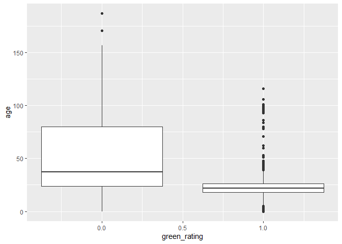

STA 380 Part 2: Exercises
================
Aidan Cremins, Peyton Lewis, Joe Morris, Amrit Sandhu
2022-07-29

``` r
library(dplyr)
```

    ## Warning: package 'dplyr' was built under R version 4.1.3

    ## 
    ## Attaching package: 'dplyr'

    ## The following objects are masked from 'package:stats':
    ## 
    ##     filter, lag

    ## The following objects are masked from 'package:base':
    ## 
    ##     intersect, setdiff, setequal, union

``` r
library(ggplot2)
```

    ## Warning: package 'ggplot2' was built under R version 4.1.3

``` r
library(forcats)
library(reshape2)
library(knitr)
```

# Probability Practice

### Part a.

P(Y) = 0.65 P(N) = 0.35 P(RC) = 0.3 P(TC) = 0.7 (P(RC)-1) P(Y\|RC) = 0.5
P(N\|RC) = 0.5

These probabilities are summarized in the table below:


We’re looking for P(Y\|TC) so we can use the rule of total probability:

P(Y) = P(Y, TC) + P(Y, RC) = P(TC) \* P(Y\|TC) + P(RC) \* P(Y\|RC)

We know all of these inputs to the equation except for P(Y\|TC), so we
want to solve for that unknown.

0.65 = 0.7 \* P(Y\|TC) + 0.3 \* 0.5

From the above equation, we find that P(Y\|TC) ≈ 0.714286. This means
that truthful clickers answer yes to the question about 71.43% of the
time.

### Part b.

P(Disease) = 0.000025 P(No Disease) = 0.999975 (1-0.000025)
P(Positive\|Disease) = .993 P(Negative\|No Disease) = 0.9999

The probabilities above are summarized in the tree diagram below:


We’re looking for P(Disease\|Positive) so we can use Baye’s Law:

$\frac{P(Disease)\*P(Positive\|Disease)}{P(Disease)\*P(Positive\|Disease)+P(No Disease)\*P(Positive\|No Disease)}$

We have almost all of the inputs that we need, however, we’re missing
P(Positive\|No Disease). These are false positives. We can find the
missing probability by taking 1 - true negatives, or 1 - 0.9999 to get
P(Positive\|No Disease) as 0.0001. Now we can solve for
P(Disease\|Positive).

$\frac{0.000025\*0.993}{0.000025\*0.993+0.999975\*0.0001}$ ≈ .198882.
Thus, if someone tests positive, they have about a 19.89% chance of
actually having the disease.

# Wrangling the Billboard Top 100

``` r
billboard = read.csv("data/billboard.csv")
```

\#Need a caption - probably something about how most are recent songs

### Part a.

``` r
billboard %>%
  group_by(performer,song) %>%
  summarize(count = n()) %>%
  arrange(desc(count)) %>%
  head(10)
```

    ## `summarise()` has grouped output by 'performer'. You can override using the
    ## `.groups` argument.

    ## # A tibble: 10 x 3
    ## # Groups:   performer [10]
    ##    performer                                 song                          count
    ##    <chr>                                     <chr>                         <int>
    ##  1 Imagine Dragons                           Radioactive                      87
    ##  2 AWOLNATION                                Sail                             79
    ##  3 Jason Mraz                                I'm Yours                        76
    ##  4 The Weeknd                                Blinding Lights                  76
    ##  5 LeAnn Rimes                               How Do I Live                    69
    ##  6 LMFAO Featuring Lauren Bennett & GoonRock Party Rock Anthem                68
    ##  7 OneRepublic                               Counting Stars                   68
    ##  8 Adele                                     Rolling In The Deep              65
    ##  9 Jewel                                     Foolish Games/You Were Meant~    65
    ## 10 Carrie Underwood                          Before He Cheats                 64

### Part b.

``` r
musical_diversity = billboard %>%
  filter(year != 1958 & year != 2021) %>%
  group_by(year) %>%
  summarize(unique_songs_per_year = length(unique(c(performer,song))))

ggplot(musical_diversity) + geom_line(aes(x = year, y = unique_songs_per_year))
```

<!-- -->

### Part c.

``` r
ten_week_hit_songs <- billboard %>%
  group_by(performer,song) %>%
  summarize(ten_week_hit = ifelse(n()>=10,"Yes","No")) %>%
  filter(ten_week_hit == "Yes")
```

    ## `summarise()` has grouped output by 'performer'. You can override using the
    ## `.groups` argument.

``` r
top_artists <- ten_week_hit_songs %>%
  group_by(performer) %>%
  summarize(num_ten_week_hit = n()) %>%
  filter(num_ten_week_hit>=30)

ggplot(top_artists) + geom_bar(aes(x = fct_reorder(performer,num_ten_week_hit), y = num_ten_week_hit),stat = "identity") + coord_flip()
```

<!-- -->

\#Visual story telling part 1: green buildings

``` r
green_buildings = read.csv("data/greenbuildings.csv")
```

``` r
ggplot(green_buildings, aes(x = Rent)) + geom_histogram() + facet_grid(.~green_rating)
```

    ## `stat_bin()` using `bins = 30`. Pick better value with `binwidth`.

<!-- -->

Green buildings tend to be newer, “newness” could justify higher rents

``` r
ggplot(green_buildings, aes(x = green_rating, y = age ,group = green_rating)) + geom_boxplot()
```

<!-- -->

``` r
ggplot(green_buildings, aes(x = age, y = Rent)) + geom_line() + facet_grid(. ~ green_rating)
```

<!-- -->

# Visual story telling part 2: Cap Metro data

``` r
cap_metro <- read.csv("data/capmetro_UT.csv")
```

``` r
cap_metro$time_of_day = ifelse(cap_metro$hour_of_day %in% c(6,7,8,9,10,11),"Morning",ifelse(cap_metro$hour_of_day %in% c(12,13,14,15,16),"Afternoon","Evening"))
time_of_day_order <- c("Morning","Afternoon","Evening")
cap_metro$activity = cap_metro$boarding + cap_metro$alighting
ggplot(cap_metro, aes(x = factor(time_of_day,levels=time_of_day_order), y = activity)) + geom_bar(stat="identity") + facet_grid(. ~ weekend)
```

<!-- -->

Activity seems to slightly increase as temperature increases, adjusted
for the difference in ridership between weekdays and weekends

``` r
riders_temp = cap_metro %>%
  group_by(timestamp) %>%
  summarize(total_riders = sum(activity), mean_temp = mean(temperature), weekend = weekend)
ggplot(riders_temp, aes(x = mean_temp, y = total_riders)) + geom_line()+facet_grid(.~weekend)
```

<!-- -->

# Clustering and PCA

``` r
wine <- read.csv("data/wine.csv")
```

``` r
set.seed(1)
wine_quant <- wine[,! names(wine) %in% c("color","quality")]
wine_pca = prcomp(wine_quant, rank=10, scale=TRUE)
boxplot(wine_pca$x[,1],as.factor(wine$color))
```

<!-- -->

Cluster 1 is mostly red wines, whereas Cluster 2 is mostly white wines.
Even just making two clusters distinguishes between the two wine colors
very well.

``` r
set.seed(1)
library(knitr)
wine_quant_scaled <- scale(wine_quant)
wine_clusters <- kmeans(wine_quant_scaled, centers=2, nstart=50)
table(wine_clusters$cluster,wine$color)
```

    ##    
    ##      red white
    ##   1 1575    68
    ##   2   24  4830

While the 2 clusters separated out the two wine colors well, they don’t
seem to distinguish between wine quality because the median quality is
essentially the same for both clusters. Even if we increase the number
of clusters pretty dramatically up to 10, there still doesn’t appear to
be major quality differences between the boxplots.

``` r
wine$cluster = as.factor(wine_clusters$cluster)
ggplot(wine, aes(x = cluster, y = quality)) + geom_boxplot()
```

<!-- -->

\<\<\<\<\<\<\< HEAD

# \#Market Segmentation

# Market Segmentation

> > > > > > > 243a1b6b2111a88510e69fdd65cfde561c881fbc

We decided to define market segments for this problem as clusters
identified through the k-means clustering approach. We omitted the
Twitter user’s randomly generated ID when creating the clusters and
instead only used the scores for each Tweet interest. We settled on
creating 10 market segments (clusters) as 10 seemed to be a sweet spot
between capturing legitimate differences between Twitter followers while
also not overloading the company with too many market segments to try to
understand.

While NutrientH20 might be interested in all 10 of the market segments
that we’ve identified, they’ll likely care the most about the segments
that would be most receptive to their products. Thus, we found the 3
market segments with the highest average scores for the
“health_nutrition” interest given that NutrientH20 seems to be a
health-oriented company. The summaries of the three segments are below:

    ##    Market Segment Interest Category Average Score
    ## 1               1  health_nutrition     12.541667
    ## 2               1  personal_fitness      6.651042
    ## 3               1           chatter      3.941406
    ## 4               1           cooking      3.425781
    ## 5               1          outdoors      2.876302
    ## 6               1     photo_sharing      2.399740
    ## 7               1              food      2.205729
    ## 8               1    current_events      1.514323
    ## 9               1          shopping      1.283854
    ## 10              1            travel      1.229167
    ## 11              3           cooking     11.684211
    ## 12              3     photo_sharing      6.088421
    ## 13              3           fashion      5.985263
    ## 14              3           chatter      4.246316
    ## 15              3            beauty      4.208421
    ## 16              3  health_nutrition      2.269474
    ## 17              3          shopping      1.755789
    ## 18              3    current_events      1.751579
    ## 19              3       college_uni      1.496842
    ## 20              3            travel      1.461053
    ## 21              4           chatter      4.653061
    ## 22              4  health_nutrition      2.795918
    ## 23              4     photo_sharing      2.448980
    ## 24              4            travel      2.244898
    ## 25              4          politics      2.244898
    ## 26              4       college_uni      1.918367
    ## 27              4     sports_fandom      1.897959
    ## 28              4    current_events      1.877551
    ## 29              4           cooking      1.795918
    ## 30              4  personal_fitness      1.755102

From the three most promising market segments, the first one appears to
be the most appealing to NutrientH20. Members of this segment have by
far the highest average scores for the “health_nutrition” interst
category, and also have high average scores for “fitness” which probably
is something closely related to what NutrientH20 does as well. There are
768 Twitter users in the most promising market segment of segment 1, and
then 475 and 49 in segments 3 and 4, respectively. Focusing in on these
market segment will hopefully yield more future customers than trying to
market to all Twitter followers.

# \<\<\<\<\<\<\< HEAD

# The Reuters Corpus

**Figure out how to download this data** - For now, just clone the
Github and copy the folder over; I’ve added it to .gitignore so it won’t
be pushed to Github

> > > > > > > 243a1b6b2111a88510e69fdd65cfde561c881fbc \# Association
> > > > > > > Rule Mining

``` r
library(arules)
```

    ## Warning: package 'arules' was built under R version 4.1.3

    ## Loading required package: Matrix

    ## 
    ## Attaching package: 'arules'

    ## The following object is masked from 'package:dplyr':
    ## 
    ##     recode

    ## The following objects are masked from 'package:base':
    ## 
    ##     abbreviate, write

``` r
library(reshape2)
#Read in the groceries.txt file. Find max number of objects
#in a basket so that R doesn't automatically cap the number
#of columns we can have
no_col <- max(count.fields("groceries.txt", sep = ","))
groceries <- read.table("groceries.txt",sep=",",fill=TRUE,col.names=c(1:no_col))
no_col <- max(count.fields("data/groceries.txt", sep = ","))
groceries <- read.table("data/groceries.txt",sep=",",fill=TRUE,col.names=c(1:no_col))
#Add in a column that indicates which customer corresponds to 
#the basket (row number)
groceries$customer = as.factor(1:nrow(groceries))
#Get data in long format
groceries <- melt(groceries,id.vars = 'customer') 
groceries <- as.data.frame(groceries)
#Drop all values that are blank
groceries <- subset(groceries, groceries$value != "")
#Group the grocery products by the customer who bought them
groceries <- split(x=groceries$value, f=groceries$customer)
#Make sure each customer is only associated with unique
#products in their basket
groceries <- lapply(groceries, unique)
```

``` r
library(arulesViz)
```

    ## Warning: package 'arulesViz' was built under R version 4.1.3

``` r
interesting_rules <- head(sort(groceries_rules, by="lift"), 10)
plot(interesting_rules, method="grouped")
```

<!-- -->

``` r
itemFrequencyPlot(items(groceries_rules),population=groceries_trans,topN=10,popCol="red")
```

<!-- -->

``` r
whole_milk_rules <- apriori(groceries_trans, 
    parameter=list(support=.01, confidence=.4, maxlen=4),appearance = list(default="lhs", rhs="whole milk"))
```

    ## Apriori
    ## 
    ## Parameter specification:
    ##  confidence minval smax arem  aval originalSupport maxtime support minlen
    ##         0.4    0.1    1 none FALSE            TRUE       5    0.01      1
    ##  maxlen target  ext
    ##       4  rules TRUE
    ## 
    ## Algorithmic control:
    ##  filter tree heap memopt load sort verbose
    ##     0.1 TRUE TRUE  FALSE TRUE    2    TRUE
    ## 
    ## Absolute minimum support count: 98 
    ## 
    ## set item appearances ...[1 item(s)] done [0.00s].
    ## set transactions ...[169 item(s), 9835 transaction(s)] done [0.00s].
    ## sorting and recoding items ... [88 item(s)] done [0.00s].
    ## creating transaction tree ... done [0.01s].
    ## checking subsets of size 1 2 3 4

    ## Warning in apriori(groceries_trans, parameter = list(support = 0.01, confidence
    ## = 0.4, : Mining stopped (maxlen reached). Only patterns up to a length of 4
    ## returned!

    ##  done [0.00s].
    ## writing ... [43 rule(s)] done [0.00s].
    ## creating S4 object  ... done [0.00s].

``` r
length(whole_milk_rules)/length(groceries_rules)
```

    ## [1] 0.6935484

``` r
#Export to a graphml file so that we can visualize this data in Gephi
library(igraph)
```

    ## Warning: package 'igraph' was built under R version 4.1.2

    ## 
    ## Attaching package: 'igraph'

    ## The following object is masked from 'package:arules':
    ## 
    ##     union

    ## The following objects are masked from 'package:dplyr':
    ## 
    ##     as_data_frame, groups, union

    ## The following objects are masked from 'package:stats':
    ## 
    ##     decompose, spectrum

    ## The following object is masked from 'package:base':
    ## 
    ##     union

``` r
groceries_graph = associations2igraph(subset(groceries_rules, lift>1), associationsAsNodes = FALSE)
igraph::write_graph(groceries_graph, file='groceries.graphml', format = "graphml")
```

======= \#Export to a graphml file so that we can visualize this data in
Gephi library(igraph) library(arulesViz) groceries_graph =
associations2igraph(subset(groceries_rules, lift\>1),
associationsAsNodes = FALSE) igraph::write_graph(groceries_graph,
file=‘groceries.graphml’, format = “graphml”) \`\`\` \>\>\>\>\>\>\>
243a1b6b2111a88510e69fdd65cfde561c881fbc
